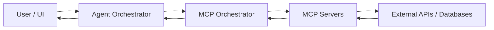

# MCP Server Maintenance and Development Guide

> For scientists and technical researchers who need to maintain, extend, or debug the biomedical MCP server layer in this platform.

---

## Table of Contents

1. [Purpose of This Guide](#1-purpose-of-this-guide)
2. [What MCP Servers Are](#2-what-mcp-servers-are)
3. [System Architecture](#3-system-architecture)
4. [Current MCP Servers](#4-current-mcp-servers)
5. [Enabling an Existing Server](#5-enabling-an-existing-server)
6. [Tool Design Guidelines](#6-tool-design-guidelines)
7. [Health Checks](#7-health-checks)
8. [Debugging Common Problems](#8-debugging-common-problems)
9. [Testing MCP Servers](#9-testing-mcp-servers)
10. [Maintaining Existing Servers](#10-maintaining-existing-servers)
11. [Documentation Standards](#11-documentation-standards)
12. [Scientist Applications](#12-scientist-applications)
13. [Best Practices](#13-best-practices)
14. [Example Workflow](#14-example-workflow)
15. [Appendix](#15-appendix)

---

## 1. Purpose of This Guide

This guide helps you:

- **Maintain** existing MCP servers — keep them working as APIs and dependencies evolve
- **Enable servers** — register and activate servers already in the repository
- **Debug problems** — trace and fix failures at every layer
- **Verify server health** — confirm a server is connected and returning real data
- **Understand the role of MCP servers** in biomedical research workflows

No deep software engineering background is required, but familiarity with the command line and Python or JavaScript basics is assumed.

---

## 2. What MCP Servers Are

**MCP (Model Context Protocol)** servers are small programs that expose scientific tools to AI agents. Think of them as adapters between the AI and external data sources.

```
AI Agent  ──asks──▶  MCP Server  ──queries──▶  PubChem / PubMed / STRING / ...
          ◀──result──             ◀──response──
```

Key facts:

- The Streamlit app **does not** call PubChem, Open Targets, or bioRxiv directly — it talks to MCP servers.
- Each MCP server defines one or more **tools** — named functions with inputs and outputs — that AI agents choose and call automatically based on the research question.
- Results come back as structured text (usually JSON), which agents synthesize into answers and reports.
- Servers run as **subprocesses** launched over stdio when the app starts.

For the full list of servers and their data sources, see [README.md](README.md).

---

## 3. System Architecture

Every tool call flows through five layers. Understanding this helps you know where to look when something breaks.



The single most important file for MCP configuration is **`streamlit-app/config.py`** — its `MCP_SERVERS` dict defines which servers exist and how to start them. If a server is not listed there, the app cannot see or use it.

For a full description of the agent and report generation flows, see [README.md](README.md).

---

## 4. Current MCP Servers

The repository includes the following servers. All are free to use except where an API key is noted.

| MCP Server | Folder | Primary Data Source | Example Tools | Typical Use Case |
|------------|--------|---------------------|---------------|------------------|
| **BioMCP** | `servers/bio/` | PubMed, ClinicalTrials.gov, OpenFDA, genes | `search_pubmed`, `trial_searcher`, `gene_getter`, `drug_getter` | Literature, trials, gene/drug lookups, regulatory context |
| **Biocontext KB** | launched via `uvx` | AlphaFold, UniProt, STRING, OpenTargets, EuropePMC, KEGG, Reactome, InterPro | Package-provided tools | Multi-source evidence gathering, identifier enrichment |
| **PubChem (augmented)** | `servers/pubchem-augmented/` | PubChem REST API | `search_compounds`, `get_compound_info`, `predict_admet_properties`, `assess_drug_likeness` | Compound characterization, medicinal chemistry analysis |
| **PubChem (simple)** | `servers/pubchem/` | PubChem REST API | `search_compounds_by_name`, `get_compound_properties` | Lightweight compound lookup |
| **STRING-db** | `servers/stringdb/` | STRING API | `get_protein_interactions`, `get_interaction_partners` | Interaction network exploration around a target |
| **Open Targets** | `servers/opentargets/` | Open Targets GraphQL API | `search_opentargets`, `get_target_associations`, `get_disease_associations` | Target-disease relevance and prioritization |
| **bioRxiv** | `servers/biorxiv/` | bioRxiv API | `search_biorxiv_preprints`, `get_biorxiv_paper`, `get_recent_biorxiv` | Preprint monitoring for emerging biology evidence |
| **medRxiv** | `servers/medrxiv/` | medRxiv API | `search_medrxiv_preprints`, `get_medrxiv_paper`, `get_recent_medrxiv` | Preprint monitoring for translational and clinical evidence |
| **Literature** | `servers/literature/` | NCBI E-utilities / PubMed | `search_pubmed`, `get_pubmed_abstract`, `get_related_articles` | Literature search and article detail retrieval |
| **Web Knowledge** | `servers/web_knowledge/` | Wikipedia, ClinicalTrials.gov, NCBI Gene | `search_wikipedia`, `search_clinical_trials`, `get_gene_info`, `convert_identifiers` | Trial lookup, identifier support, gene/drug context |
| **Data Analysis** | `servers/data_analysis/` | Local computation | `calculate_statistics`, `calculate_correlation`, `analyze_sequence` | Quick analytical support inside agent workflows |

---

## 5. Enabling an Existing Server

The repository already contains all server code under `servers/`. Enabling a server means installing its dependencies and registering it so the app can find it.

### Step 1 — Install the server's dependencies

Navigate to the server folder and install:

```bash
cd servers/<server_name>
npm install
```

For the TypeScript server (`pubchem-augmented`), also run a build step:

```bash
npm run build
```

For Python wrapper servers (e.g., `servers/bio/`), dependencies are managed centrally — just ensure the venv is installed via `python3 install.py` from the repo root.

### Step 2 — Register the server in `config.py`

Open `streamlit-app/config.py` and add an entry to the `MCP_SERVERS` dict:

```python
"server_name": {
    "command": "node",
    "args": ["../servers/server_name/index.js"],
    "description": "Short description of what this server provides"
}
```

The `description` field matters — agents use it to decide which server's tools to call for a given question.

### Step 3 — Add any required API keys

Some servers need credentials in `streamlit-app/.env`. Check the server's folder or the table in Section 4. Only BioMCP's NCI tools require a key (`NCI_API_KEY`); all other servers are open access.

### Step 4 — Verify it's connected

Start the app and check the terminal for a confirmation line:

```
[OK] Connected to server_name, loaded N tools
```

If you see `[FAIL]` instead, go to [Section 8 — Debugging](#8-debugging-common-problems).

---

## 6. Tool Design Guidelines

These principles apply when modifying or extending an existing server's tool definitions.

### Naming conventions

Tools should follow a `verb_source_noun` or `verb_noun` pattern. The data source should be in the name when multiple servers might offer similar tools.

| Good | Bad |
|------|-----|
| `search_biorxiv_preprints` | `run_query` |
| `get_target_associations` | `get_data` |
| `get_protein_interactions` | `api_call` |

### Search / detail pairing

Structure tools in pairs — a lightweight search first, a full-detail getter second:

```
search_medrxiv_preprints  →  get_medrxiv_paper
search_pubmed             →  get_pubmed_abstract
search_opentargets        →  get_target_associations
```

### Output principles

- Return structured JSON, not free text
- Include `count`, result IDs, and source links
- Cap results (default 10, max ~25) — large payloads slow the agent and can exceed context limits
- Truncate long text fields like abstracts to a few hundred characters

---

## 7. Health Checks

Run through this checklist whenever you suspect a server is broken or after any update.

### Quick health checklist

- [ ] **Server starts manually** — `npm start` (or equivalent) runs without errors
- [ ] **Dependencies installed** — `node_modules/` present for Node; packages importable in venv for Python
- [ ] **API keys / env vars set** — check `streamlit-app/.env` has required keys
- [ ] **App startup log shows `[OK]`** — `Connected to <server_name>, loaded N tools`
- [ ] **At least one tool call succeeds** — ask a question in chat that uses the server
- [ ] **No traceback in terminal** — no Python or Node stack trace printed
- [ ] **External API is reachable** — confirm the upstream service is not down
- [ ] **Response schema still matches** — field names in the response match what the server parses
- [ ] **Rate limits not exceeded** — no 429 errors in logs
- [ ] **Results are plausible** — query a known entity (aspirin, TP53) and verify the data looks right

### Reading startup logs

Start the app and watch the terminal for a line per server:

```
Connecting to MCP server: stringdb...
[OK] Connected to stringdb, loaded 3 tools

Connecting to MCP server: my_server...
[FAIL] Failed to connect to my_server: Connection closed
```

A `[FAIL]` means the server process crashed before it could respond. Go to [Section 8](#8-debugging-common-problems).

### Known-good test queries per server

| Server | Test query in chat |
|--------|--------------------|
| PubChem | `"What are the properties of aspirin?"` |
| STRING | `"What proteins interact with TP53?"` |
| Open Targets | `"What diseases is BRCA1 associated with?"` |
| Literature | `"Search PubMed for imatinib leukemia"` |
| bioRxiv | `"Find recent preprints on CRISPR"` |
| BioMCP | `"Get gene info for EGFR"` |
| medRxiv | `"Search medRxiv for pembrolizumab"` |
| Web Knowledge | `"Search ClinicalTrials.gov for nivolumab lung cancer"` |

---

## 8. Debugging Common Problems

| Problem | Likely Cause | How to Diagnose | Fix |
|---------|-------------|-----------------|-----|
| **Server fails to start** | Missing dependency, syntax error, wrong path | Run the server directly from its folder and read stderr | Install deps; check `command`/`args` in `config.py` |
| **`[FAIL] Connection closed` at startup** | Server crashes immediately | `cd servers/<name> && npm start` to see the raw error | Fix the crash — usually a missing `node_modules` or import error |
| **Tool not visible to agent** | Server not in `MCP_SERVERS`, or `list_tools` failed | Check startup logs; verify `config.py` entry exists | Add to `MCP_SERVERS`; confirm the server's tool list handler works |
| **Tool fails when called** | Handler error or bad input | Ask a minimal question; read the returned error text | Fix validation or handler logic in the server file |
| **401 / 403 from API** | Missing or invalid API key | Check `streamlit-app/.env`; confirm the env var name matches what the server reads | Set the correct key |
| **404 from API** | Wrong endpoint or API version changed | Check the server's API call against current upstream docs | Update the endpoint path or identifier format |
| **Timeout** | Upstream API slow or result set too large | Test with a minimal query | Reduce `max_results`; the server may need a timeout guard |
| **JSON parse error** | API returned an HTML error page instead of JSON | Check if the API endpoint is still valid | Handle non-JSON responses; check the API's status page |
| **Empty results** | Query too narrow, or upstream schema changed | Test the same query directly on the API's website | Relax the query; update field names if the API changed |
| **`ModuleNotFoundError`** | Missing Python package or wrong venv | Start the server from within the activated venv | `pip install <package>`; add to `requirements.txt` |
| **`Cannot find module`** | Node `node_modules` missing | Check whether `npm install` was run | `cd servers/<name> && npm install` |
| **Output too large** | Raw API payload returned unfiltered | Check response size in terminal | Reduce `max_results`; truncate long text fields |
| **Agent picks wrong server** | Tool descriptions are ambiguous or overlap | Review tool names and descriptions across servers | Make descriptions more specific |
| **Works locally, fails in app** | Stdio wiring issue in `mcp_tools.py` | Check `MCPToolWrapper.connect()` output in logs | Verify the `config.py` path is correct relative to `streamlit-app/` |
| **Env var missing** | `.env` not loaded, or wrong variable name | Add a temporary print of `bool(os.getenv("MY_KEY"))` | Add the variable to `streamlit-app/.env` |

---

## 9. Testing MCP Servers

Test at each level — a server can pass one level and fail the next.

### Level 1 — Manual startup

Navigate to the server folder and start it directly:

```bash
cd servers/opentargets
npm start
# Should wait silently for input (Ctrl+C to exit)
```

If it crashes immediately, read the error in the terminal — this is the most useful debugging output.

### Level 2 — Tool discovery

Start the Streamlit app and check the terminal for the `[OK] Connected` line. If that appears, the server handshake succeeded and its tools are registered.

### Level 3 — Tool call in chat

Type a test question into the chat UI (see the table in [Section 7](#7-health-checks)). Confirm in the terminal that the correct server's tool was called and returned real data, not an error.

### Level 4 — Regression check after updates

After any dependency update or API change:

- Repeat a known-good query
- Verify output format still looks correct
- Confirm no other server was accidentally broken

---

## 10. Maintaining Existing Servers

### Routine tasks

- Update dependencies **one server at a time** — changing all servers together makes regressions hard to isolate
- Monitor upstream API changes — endpoints, authentication, and response schemas can change without notice
- Review terminal logs after failures — they reveal far more than the UI does
- Keep server READMEs current, especially authentication steps and API rate limits

### Dependency updates

For Node servers, update from within the server folder:

```bash
cd servers/stringdb
npm outdated        # see what's behind
npm update          # update within semver constraints
npm start           # confirm clean startup before committing
```

For Python-side dependencies (centralized in `streamlit-app/requirements.txt`):

```bash
cd streamlit-app
source venv/bin/activate
pip list --outdated
pip install --upgrade <package>
```

Always re-run a test query after updating.

### Server-specific upgrade notes

| Server | Upgrade consideration |
|--------|----------------------|
| **STRING-db** | Consider an official STRING MCP package if one becomes available — better coverage and maintenance |
| **Open Targets** | An official Open Targets Platform MCP may offer richer coverage than the current local wrapper |
| **PubChem** | Prefer `servers/pubchem-augmented/` over `servers/pubchem/` — 30+ tools vs. a handful |
| **BioContext KB** | Runs via `uvx biocontext_kb@latest` — update by bumping the version tag in `config.py` |
| **BioMCP** | Runs from the `biomcp` Python package — upgrade with `pip install --upgrade biomcp` in the venv |

---

## 11. Documentation Standards

Every server should have a `README.md` in its folder. Use this template:

```markdown
# <Server Name> MCP Server

## Purpose
One paragraph: what research questions this server helps answer.

## Data Source
- Source name and URL
- API documentation link
- Rate limits and access notes

## Tools Provided

| Tool Name | Description | Required Inputs | Example Output |
|-----------|-------------|-----------------|----------------|
| `tool_name` | What it does | `param` (type) | `{ "count": 3, ... }` |

## Required Environment Variables

| Variable | Required | Description |
|----------|----------|-------------|
| `MY_API_KEY` | Yes | API key from example.com |

## How to Run

cd servers/server_name
npm install
npm start

## Example Chat Queries

"What are the protein interactions for EGFR?"
"Find approved drugs for VEGFR2"

## Common Errors

| Error | Cause | Fix |
|-------|-------|-----|
| 401 Unauthorized | Missing API key | Set MY_API_KEY in .env |
| Connection closed | Missing node_modules | Run npm install |

## Maintenance Notes
- Last verified working: YYYY-MM-DD
- API version tested against: vX.Y

## Owner / Last Updated
- Updated by: [Name]
- Date: YYYY-MM-DD
```

---

## 12. Scientist Applications

### What you can do today

| Category | Capability |
|----------|-----------|
| **Drug / Compound** | Chemical properties, ADMET predictions, drug-likeness, bioassays, safety flags |
| **Target analysis** | Gene/protein info, target-disease associations, interaction networks, pathway context |
| **Literature** | PubMed search, abstract retrieval, author search, related articles, DOI lookup |
| **Preprints** | Real-time monitoring of bioRxiv and medRxiv for emerging evidence |
| **Clinical trials** | ClinicalTrials.gov search, trial status, interventions, eligibility |
| **Regulatory / safety** | FDA adverse events, drug labels via OpenFDA |
| **Identifiers** | Gene ID ↔ symbol ↔ UniProt conversions |
| **Analysis** | Basic statistics, sequence analysis, molecular descriptors |

### Future extensions

- Drug repurposing workflows across Open Targets + STRING
- Biomarker discovery via TCGA, GTEx, cBioPortal
- Automated compound safety triage
- Literature surveillance agents for a target or indication
- Multi-omics integration (proteomics, transcriptomics, metabolomics)

---

## 13. Best Practices

**For scientists using the platform:**

- Start with a **clear biological question** — vague questions produce vague answers
- Identify the **entity type** first: compound, gene, protein, disease, trial, pathway, or paper
- Use **search tools first**, then **detail tools** — don't ask for full records on 20 hits at once
- Always **check source provenance** — confirm the data came from a real database call
- **Validate important findings** against the primary database directly (e.g., Open Targets website, PubChem)
- Treat agent outputs as **research support**, not final scientific truth — agents can misparse responses or draw on outdated records

**For developers maintaining servers:**

- Register only servers that are fully working and tested — a broken registration degrades the whole system
- Keep `MCP_SERVERS` descriptions in `config.py` accurate — the agent uses them to decide which tool to call
- Never modify multiple servers in one commit — isolate changes for easier rollback
- Always run a known-good test query after any update before pushing

---

## 14. Example Workflow

**Research question:** *"Is target X relevant to disease Y, and are there existing drugs or active trials?"*

| Step | What to ask | Server used |
|------|------------|-------------|
| 1. Resolve identifiers | `"What is the gene ID for [target name]?"` | Web Knowledge |
| 2. Target-disease association | `"What are the Open Targets associations for [gene] in [disease]?"` | Open Targets |
| 3. Interaction network | `"What proteins interact with [gene]?"` | STRING-db |
| 4. Pathway context | `"What pathways involve [gene]?"` | Biocontext KB |
| 5. Literature evidence | `"Search PubMed for [gene] [disease] mechanism"` | Literature / BioMCP |
| 6. Preprints | `"Find recent preprints on [gene] [disease]"` | bioRxiv / medRxiv |
| 7. Clinical trials | `"Are there active trials targeting [gene/drug] in [disease]?"` | BioMCP / Web Knowledge |
| 8. Drug safety | `"What does OpenFDA say about [drug name]?"` | BioMCP |
| 9. Summarize | `"Summarize the evidence for [gene] in [disease] with confidence levels"` | Agent synthesis |

---

## 15. Appendix

### Glossary

| Term | Meaning |
|------|---------|
| **MCP** | Model Context Protocol — a standard for exposing tool capabilities to AI agents |
| **Server** | A program that publishes MCP tools; runs as a subprocess |
| **Tool** | A named callable function exposed by an MCP server |
| **Stdio** | The communication channel — the app pipes messages to/from the server process |
| **Orchestrator** | The layer that routes tool calls to the right server and tracks health |
| **Gateway** | The governance layer — rate limiting, audit logging, compliance checks |
| **JSON** | Structured text format used for API responses and MCP tool outputs |
| **Environment variable** | External configuration such as API keys, stored in `.env` outside of code |
| **Rate limit** | A cap on API requests per minute/hour enforced by the external service |
| **Traceback** | A Python error stack trace — shows exactly where a failure occurred |
| **`uvx`** | A tool that launches Python MCP packages without a manual install step |
| **ADMET** | Absorption, Distribution, Metabolism, Excretion, Toxicity — key drug property categories |

---

### Checklist: Enabling a Server

- [ ] Locate the server folder under `servers/`
- [ ] Run `npm install` (or confirm Python deps are in the venv)
- [ ] For `pubchem-augmented`: run `npm run build`
- [ ] Add or verify the entry in `streamlit-app/config.py` → `MCP_SERVERS`
- [ ] Add any required API keys to `streamlit-app/.env`
- [ ] Start the app and confirm `[OK] Connected to <name>` in logs
- [ ] Run a known-good test query in the chat UI
- [ ] Write or update the server's `README.md`

---

### Checklist: Debugging a Broken Server

- [ ] Confirm the server starts on its own (`npm start` or `python run_server.py`)
- [ ] Confirm dependencies are installed (`node_modules/` present; package importable in venv)
- [ ] Confirm env vars are present (check `streamlit-app/.env`)
- [ ] Confirm `MCP_SERVERS` registration path is correct in `config.py`
- [ ] Confirm `list_tools()` succeeds — server appears in startup logs with `[OK]`
- [ ] Confirm a minimal tool call succeeds (search for "aspirin" or "TP53")
- [ ] Inspect terminal for traceback or HTTP error codes
- [ ] Check upstream API health and any recent schema changes
- [ ] Verify output shape is still usable by the app
- [ ] Verify no other server was broken as a side effect

---

### Template: Requesting a New MCP Server

Use this when proposing that a new data source be added to the platform:

```markdown
# New MCP Server Request

## Scientific Need
What research question or workflow should this server support?

## Proposed Data Source
- Database / API / package:
- Official documentation URL:

## Example Queries
- Example 1:
- Example 2:

## Required Outputs
- IDs / accessions needed:
- Metadata fields needed:
- Links / provenance:

## Authentication / Access Constraints
- API key required? Yes / No
- Institutional access required? Yes / No
- Rate limits:

## Priority
Low / Medium / High

## Requested By
Name / team / date
```
